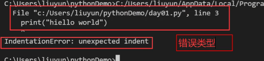

# 异常捕获:python代码跑着跑着可能会报错


1.异常： 程序在运行过程中报的错误就叫异常；ValueError、IndexError叫异常类型名
当程序出现异常的时候程序直接结束，不会继续执行后续的代码

# print(int('abc'))   # ValueError: invalid literal for int() with base 10: 'abc'
# print([1, 2][10])   # IndexError: list index out of range
# print('=========')
2.异常捕获: 让程序出现异常的时候不崩溃，程序可以继续执行
1). 什么时候需要捕获异常: 明知道某个位置可能会出现异常，但是程序员又没有办法控制的时候
2). 怎么捕获异常
语法一: 捕获任意可以捕获的异常
```python
try:
    代码块1(需要捕获异常的代码)
except:
    代码块2(出现异常后对异常进行的处理)
finally:

    代码块3
```
其他语法
执行过程: 先执行代码块1，如果出现异常，程序不崩溃，马上执行代码块2；执行完代码块2再执行其他语句。
如果代码块1中没有出现异常，不执行代码块2，直接执行后面的其他语句

语法二: 捕获指定的一种异常
```python
try:
    代码块1
except 异常类型:
    代码块2
finally:

    代码块3
```
执行过程: 先执行代码块1，如果代码块1出现异常，检测异常类型和except后面的异常类型是否一致；
如果一致，程序不崩溃，直接执行代码块2；如果不一致，程序直接崩溃。
如果没有出现异常，不执行代码块2，直接执行后面的其他语句

语法三: 捕获多种异常，对不同进行相同的处理
```python
try:
    代码块1
except (异常类型1, 异常类型2,...):
    代码块2
finally:
    代码块3
```
语法四: 捕获多种异常，对不同进行不同的处理
```python
try:
    代码块1
except 异常类型1：
    代码块11
except 异常类型2:
    代码块22
except 异常类型3:
    代码块33
...
finally:
    代码块3
```
"""
3.关键字finally
所有的异常捕获结构的最后可以添加一个finally
finally后面的代码块，不管try中的代码出现任何情况都会执行：
1）代码块1没有异常finally会执行
2）代码块1中有异常，异常被捕获finally会执行
3）代码块1中有异常，异常没有被捕获finally会执行
```python
print('===================语法1========================')

try:
    print(int('abc'))
    print([1, 2][10])
    print('++++++++')
except:
    print('出现了异常!')


print('=========================语法2====================')

try:
    print(int('abc'))
    print([1, 2][10])
    print('++++++++')
except ValueError:
    print('下标越界!')

print('语法2结束')

# raise ValueError
print('=====================finally=========================')

 try:
     print('++++')
     print({'name': '张三', 'age': 18}['gender'])
     print('hello'[100])
     print(max([10, 'abc', True]))
 except IndexError:
     print('出现异常')
 finally:
     print('写遗书！')
```

# 1.异常
- 什么是异常：python代码不能正确的执行时，会抛出对应的错误信息
- 异常信息包含了代码的信息（代码的行数，文件，异常类型）
- 使用异常信息判断代码错误的原因
- TrackBack：一般看最后一行的信息，找出自己的写的那一句代码，其他报错忽略
# 2.异常的类型
- ERROR:错误类
- exception：异常类
# 3.exception
- class类型
-  python所有异常的基础类型，由python定义而来


# 4.异常的特点
python遇到exception异常会自动抛出异常，并且会终止代码的运行
# 5.常见异常
- error 错误类型
- 缩进异常
- 

as e 这里的作用是如果报错了，获取报错信息
- 异常处理的简写版本：
```python
try:
    print()
except:
    
```

# 6.捕获异常
- 捕获异常的定义：当我们想代码遇见异常的，不让代码停止运行，增强代码的健壮性，让代码不会因为一些小问题而立刻崩溃，在自动化与测开当中经常使用该方法。
- 一般用在不可控的代码上面，例如调第三方接口/服务

# 7.异常处理的基本流
- 异常处理的关键字


# 8.断点
- 代码运行到至断点时自动暂停，并且打印出当前已经存在的变量
- #####  有且只有运行到有断点的代码上时，才会暂停
- 断点分为单步运行和继续运行，继续运行会忽略掉没有断点的代码直接跳过，单步运行，执行的每句代码都会暂停运行
- 打断点的调试功能：主要是为了定位哪一个环节出了问题

