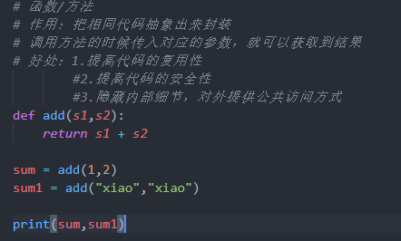
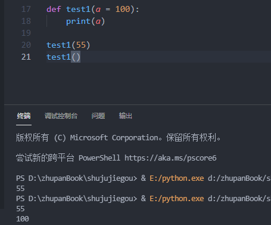

# 方法/函数

在类中叫方法，此外叫函数
# 参数
- 必填参数

- 默认参数

    参数有默认值，不传则使用默认值，传参则代替默认参数，传参可以传任意数据类型

- 可变参数
以元组的形式存在，长度不受限制
```python
def test1(*args):
    print(args,type(args))
test1(1,2,"xiaoxiao",True)
```

- 关键字参数
以键值对的形式存在
```python
def test1(**kwargs):
    print(kwargs,type(kwargs))

test1(a = 100,b = 200,c = 300)
```

- 组合参数
```python
def  test1(a,b = 100,*args,**kwargs)

```
- 万能参数
```python
def tst1(*args,**kwargs)
print(args)
print(kwargs)

test1(1,a= 100)
```


# 返回值
- return 和 print 的区别
    1.print 就是打印一次结果
    2.return 返回值，在后面需要用到这个结果就用返回值将结果赋值给新的调用方法的变量
    3.return可以返回任意的数据类型
    4.如果没有写return，返回值默认为None


