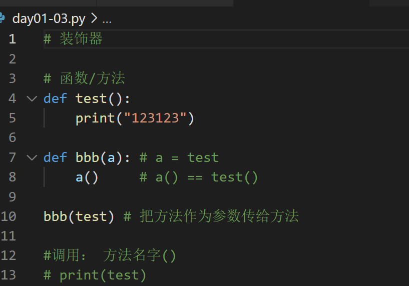
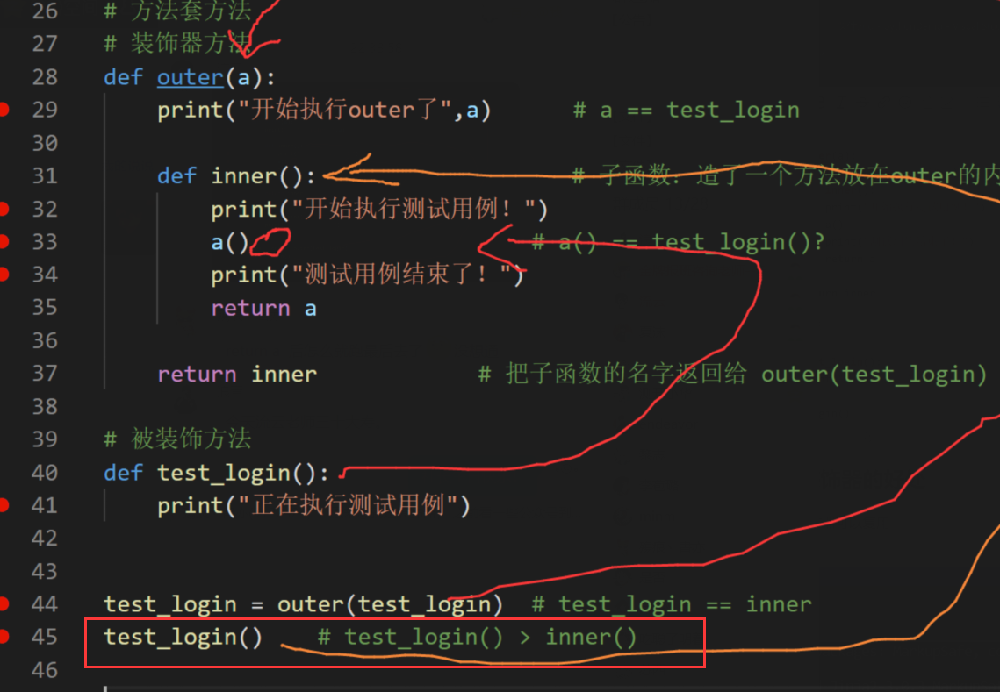

# 装饰器
- 方法的本质
    - 方法本身在python被定义为数据类型
    

- 装饰器的原理



- 装饰器的调用
@函数名

```python

# 装饰器：不改变函数的原有代码，对函数进行功能扩展
# 方法套方法
# 装饰器方法
def outer(a):
    print("开始执行outer了",a)
    def inner():
        print("开始执行测试用例！")
        a()                     # a() == test_login()?
        print("测试用例结束了！")
        return a
  
    return inner

# 被装饰方法
@outer   # @outer == test_login = outer(test_login)  # test_login == inner
def test_login():
    print("正在执行测试用例")

test_login()    # test_login() > inner()

```

- 装饰器的好处
装饰器可以复用

```python
、# 装饰器：不改变函数的原有代码，对函数进行功能扩展
# 方法套方法
# 装饰器方法:固定的，python设计的这种模式
def outer(a):
    print("开始执行outer了",a)      # a == test_login
  
    def inner():                   # 子函数：造了一个方法放在outer的内部
        print("开始执行测试用例！")
        a()                     # a() == test_login()?
        print("测试用例结束了！")
        return a
  
    return inner            # 把子函数的名字返回给 outer(test_login)  

# 被装饰方法
# test_login = outer(test_login)  # test_login == inner
@outer  # python规定的
def test_login():
    print("正在执行测试用例登录")
  
@outer      # test_login = outer(test_regist)  # test_regist == inner
def test_regist():
    print("正在执行测试用例注册")

test_login()    # test_login() > inner()
print("-------------------------------------")
test_regist()


```


- 装饰器的参数
    如果被装饰的方法有不固定的参数，我们就会遇到报错，缺少参数的传递。

        每个被装饰的方法参数是不一样的
        长度不一致
        类型不一致
```python
#装饰器参数

def outer(a):
    print("开始执行outer了",a)      # a == test_login
  
    def inner(*args, **kwargs):                   # 子函数：造了一个方法放在outer的内部 {"username":"123456"}
        print("开始执行测试用例！")
        a(*args, **kwargs)                     # a() == test_login()?  // a(1) > test_login(1) 
        print("测试用例结束了！")
        return a
  
    return inner            # 把子函数的名字返回给 outer(test_login)  

# 被装饰方法
# test_login = outer(test_login)  # test_login == inner：没有参数 # inner通过装饰器的万能参数实现任意参数的传递
@outer  # python规定的
def test_login(a):
    print("正在执行测试用例登录{}".format(a)) 
  
@outer      # test_login = outer(test_regist)  # test_regist == inner
def test_regist(b, c, d, name):
    print("正在执行测试用例注册{}{}{}".format(b, c, d))
    print(name)

test_login(1)    # test_login() > inner() # test_login(1) == inner(1)
print("-------------------------------------")
test_regist(1,2,3, name="123456")


```