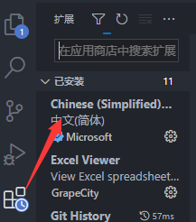
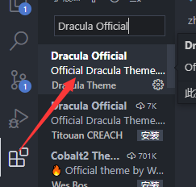

# vscode 的介绍
- vscode是一个微软出品的轻量级的写代码的编辑器
- vscode除了可以用来写代码之外，也是一款很好用的文档编辑工具。
通过vscode我们可以实现在vscode上编写各种语言的代码
我们也可以利用vscode的插件来实现各种软件的功能，比如mysql插件实现简单的navicat的功能。
# vscode的安装
- vscode的安装十分简单。只需要在官方网站下载安装包
# vscode的汉化
如图：
# vscode的主题插件
- 吸血鬼主题：
- 更多主题百度搜索
# vscode的文档插件
- Markdown Preview Enhanced: 文档编辑插件，加强vscode对markdown的支持
- PasteImage 这个插件可以让我们直接通过粘贴复制的方式插入图片到文档中
- 文件格式md
# vscode的操纵数据库的插件
- Mysql 操作关系型数据库的插件，直接通过编写sql语句的方式来操作数据库
- Redis 操作菲关系型数据库redis的插件，直接通过redis的命令来操作数据库
- remote -ssh 让我们可以远程操作其他电脑的插件，可以直接让我们在Vscode上面操作其他电脑/服务器上的代码
# vscode配置git
1.配置环境变量
```cmd
git config --global user.name "用户名"
git config --global user.email "用户名"
git config --list  查看配置
```
2.生成sshkey
```
ssh-keygen -t rsa -C "your_email@163.com"
文件生成后找到.pub后缀名的文件，打开方式为记事本，复制里面所有内容
将刚刚复制的内容粘贴到->个人头像->preference->sshkey  将内容粘贴到key里
```
3.同步到本地
```
运用命令行名利orvscode自带的操作同步导入
```
# vscode用法总结
vscode提供的插件全面且强大，更多的插件用法其实通过百度检索，能够详细看到每个插件的用法，确定自己的需求然后通过百度去解决自己对于vscode插件的需求。