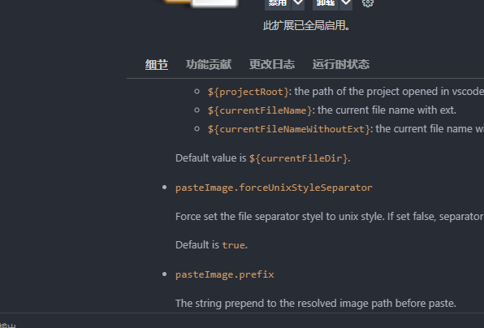

十四、后端服务器搭建

14.1首先需要一台linux服务器：

公网ip地址，固定的买电信、联通、移动
centos7.6-7.9
腾讯云：https://cloud.tencent.com/act/new?from=15579

购买完成后，打开腾讯云服务器的控制台：
https://console.cloud.tencent.com/lighthouse/instance/index

14.2确认是centos7.6
我们服务器环境需要centos7.6，如果系统在购买时选配错了，那就在控制台重装系统就可以了。
重装路径：

选择系统镜像：

14.3获取服务器的连接信息

服务器ip地址：1.15.184.84
账号：root
密码：1qaz!QAZ  （需要重置密码）

14.4修改服务器的防火墙
腾讯云防火墙默认会限制我们访问一些端口，所以需要放开所有端口的访问

tcp端口
udp端口

14.5使用软件远程连接linux服务器
windows：

xshell：远程连接linux
xftp：上传/下载文件

mac：

termius：远程连接linux
filezilla：上传/下载文件

14.6连接linux的服务器
略

14.7linux安装python环境
首先使用xftp/filezilla上传python的linux安装包，配置环境。

上传python的linux安装包
使用下面每一行命令来安装python3.8环境

yum install zlib-devel bzip2-devel openssl-devel ncurses-devel sqlite-devel readline-devel tk-devel gcc make
yum install libffi-devel -y
tar zxvf Python-v3.8.0.tgz
mkdir /usr/local/python3
cd Python-3.8.0/
./configure
make && make install

验证环境是否安装成功

python3 -V  （这里是python3而不是python！！！）
pip3 -V

14.8部署python接口到服务器上

需要检查python项目的每个py文件的第一行是否已经加上标识符，如果没有加下面的代码，在linux服务器上部署时可能会报错！

# -*- coding: utf-8 -*-

再把本地的python项目源代码打包成zip上传

使用unzip命令去解压项目源代码
zip：将文件压缩成.zip文件
unzip：将zip压缩包解压出来

创建httpServer文件夹，并将源代码压缩包移动到httpServer文件夹
# 创建httpServer文件用来存在所有的源代码
mkdir httpServer

# 把上传的源代码压缩包移动到httpServer文件夹下
mv httpServer.zip httpServer

# 打开httpServer文件夹
cd httpServer

# 把项目源代码解压出来
unzip httpServer

14.9部署项目
不能使用原先直接运行run.py的方式来部署项目，这种方式只适用于在开发代码的时候，真正在生产环境部署项目，我们需要借助 gunicorn 软件实现python项目的部署。

安装gunicorn第三方包
pip3 install gunicorn -i https://pypi.tuna.tsinghua.edu.cn/simple

安装所依赖的第三方包
pip3 install -r requirments.txt -i https://pypi.tuna.tsinghua.edu.cn/simple

修改run.py文件的启动代码
# 为了gunicorn在部署项目的时候和原有的冲突
if __name__ == "__main__":
    app.run()

使用gunicorn执行shell命令部署项目
gunicorn -w 2 -b 0.0.0.0:2333 run:app

# -w 进程数，跟cpu核心数一样
# -b 访问的ip和端口
# run:app：运行run.py文件里面的app对象

部署成功后，在浏览器访问http://你的服务器地址:2333/，如果看到了接口的helloworld输出，表示部署成功了！

后台运行：为了不让服务随着shell窗口的关闭而关闭，需要让服务在后台运行。
gunicorn -w 2 -b 0.0.0.0:2333 run:app &

14.10使用shell脚本启动项目

14.10.1查看后台服务进程
ps -ef | grep gunicorn
kill -9 父进程
tips：在linux中，软件是由父进程+子进程表示的，可以关闭父进程从而直接kill所有的子进程

14.10.2使用shell脚本启动项目服务

sh文件在linux中被称为shell脚本，它linux的可执行命令的集合。

cd ~

touch start_httpserver.sh

vim start_httpserver.sh
# 输入以下内容：

#! /bin/bash

# cd 项目主目录
cd /root/httpServer

# 使用gunicorn后台启动项目
gunicorn -w 2 -b 0.0.0.0:2333 run:app &

保存并退出

给sh文件赋值权限

chmod +x start_httpserver.sh

最后启动项目

./start_httpserver.sh

14.10.3log文件的使用

error：错误日志
access：访问日志

修改sh文件的启动脚本，加上访问和错误日志就可以了。
在执行命令之前，必须先到httpServer文件夹下面创建logs文件夹
gunicorn -w 2 -b 0.0.0.0:2333 --access-logfile logs/access.log --error-logfile logs/error.log run:app &
此时项目的sh启动文件内容为：
#! /bin/bash

# cd 项目主目录
cd /root/httpServer

# 使用gunicorn后台启动项目
gunicorn -w 2 -b 0.0.0.0:2333 --access-logfile logs/access.log --error-logfile logs/error.log run:app &

